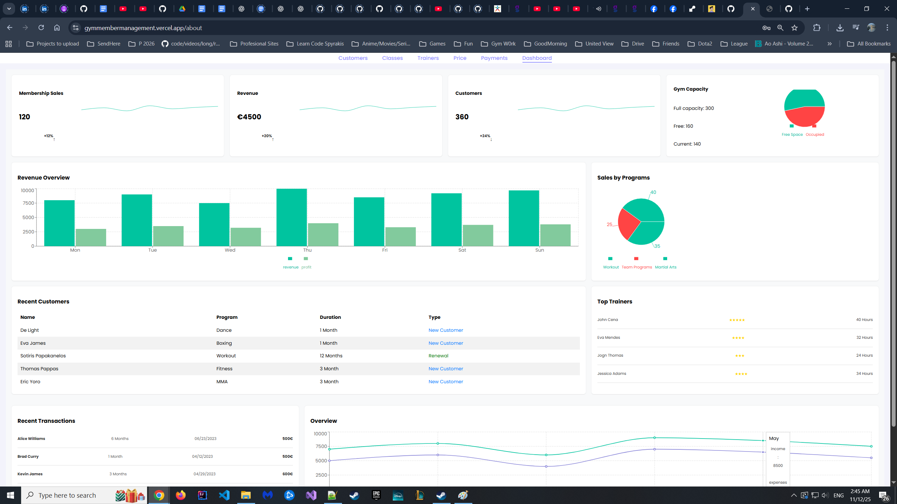
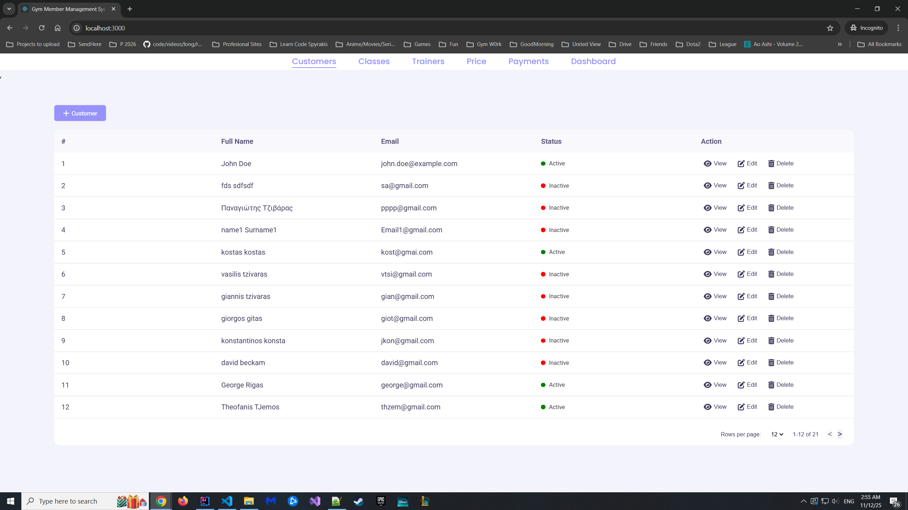
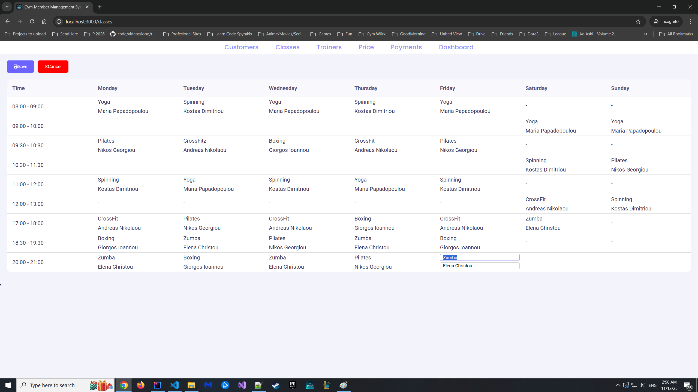
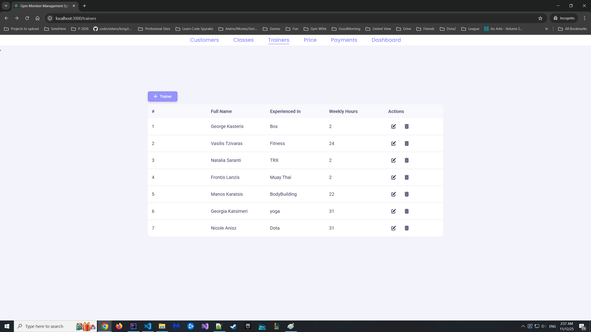
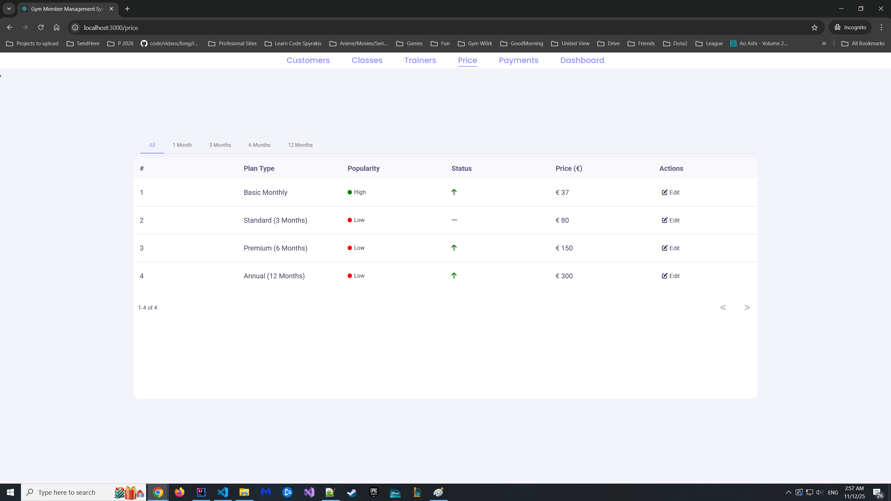
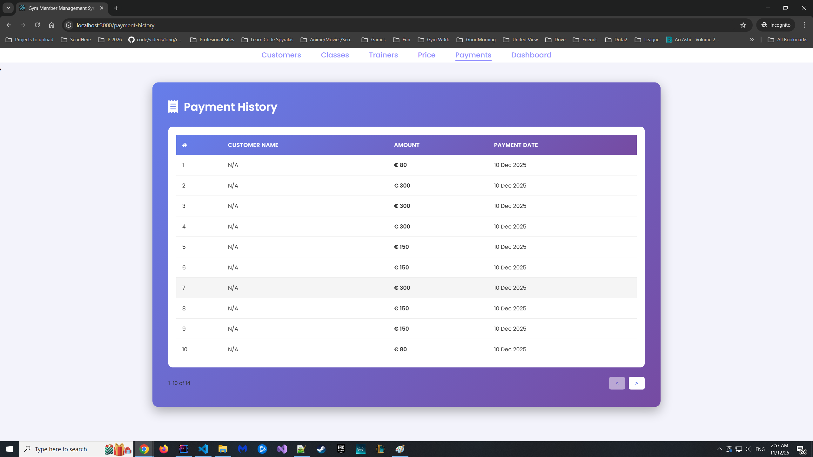
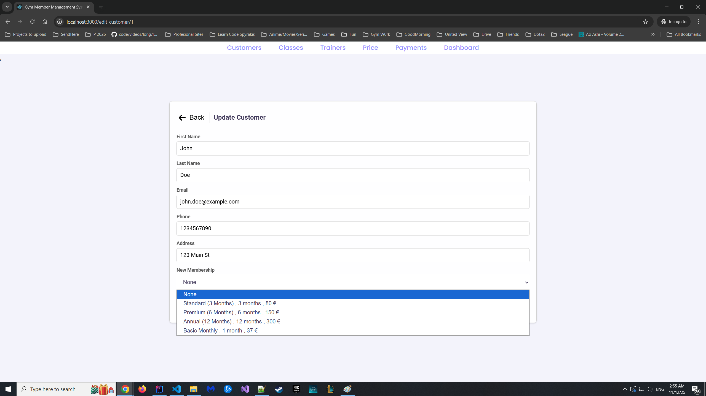
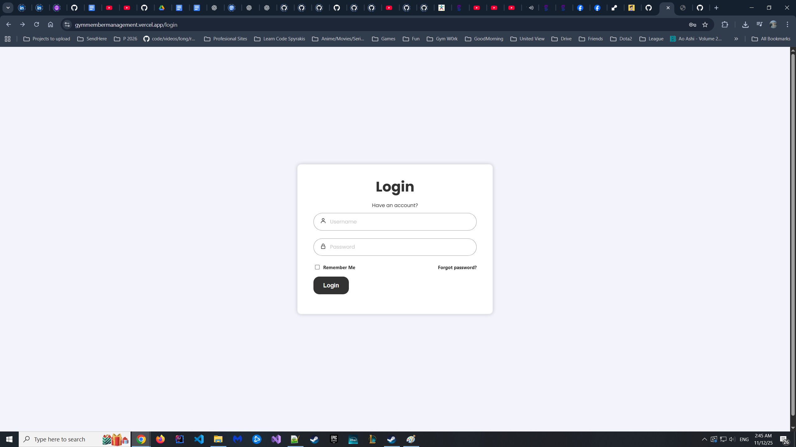

# Gym Member Management System

A full-stack web application designed to streamline gym operations by providing administrators with tools to manage members, trainers, class schedules, memberships, and payments—all from a centralized dashboard.

## 🌐 Live Demo (Searching for Stable Free Server..)

- **Frontend**: [https://gymmembermanagement.vercel.app](https://gymmembermanagement.vercel.app)
- **Backend API**: [https://gym-member-management-2.onrender.com](https://gym-member-management-2.onrender.com)
- **API Documentation**: [https://gym-member-management-2.onrender.com/swagger-ui.html](https://gym-member-management-2.onrender.com/swagger-ui.html)

## 📸 Screenshots

### Dashboard - Analytics & Metrics

*Real-time business metrics with revenue charts and capacity monitoring*

### Customer Management

*Searchable customer database with inline editing and status tracking*

### Class Schedule

*Weekly class timetable with drag-and-drop scheduling*

### Trainer Management

*Trainer profiles with specialties and workload tracking*

### Membership Pricing

*Dynamic pricing plans with popularity metrics*

### Payment History

*Transaction records and membership renewal tracking*

### Membership Purchase

*Streamlined checkout process for membership plans*

### Login

*Secure authentication portal*

### Database Schema

*Normalized relational database structure*

## The Problem It Solves

Managing a gym involves juggling multiple responsibilities: tracking member information, coordinating trainer schedules, managing class timetables, processing payments, and analyzing business performance. Traditional methods using spreadsheets or paper-based systems are inefficient, error-prone, and don't scale well. This application digitizes and centralizes these operations, enabling gym administrators to:

- Quickly access and update member profiles
- Monitor membership status and payment history
- Coordinate class schedules with trainer availability
- Visualize business metrics through interactive charts
- Reduce administrative overhead and human error

## Key Features

### Customer Management
- **CRUD Operations**: Create, view, update, and delete customer profiles
- **Detailed Member Profiles**: Track contact information, addresses, and membership status
- **Smart Tables**: Searchable, sortable customer lists with pagination
- **Status Tracking**: Real-time indicators for active/inactive memberships

### Membership & Pricing
- **Dynamic Pricing Plans**: Manage multiple membership tiers (1-month, 3-month, 12-month plans)
- **Inline Editing**: Update membership prices directly from the pricing table
- **Popularity Metrics**: Track which membership plans are trending

### Trainer Management
- **Trainer Profiles**: Add trainers with specialties (Boxing, MMA, Dance, Fitness, etc.)
- **Workload Tracking**: Monitor weekly hours for each trainer
- **Easy Assignment**: Connect trainers to specific classes

### Class Scheduling
- **Weekly Timetable View**: Visual grid showing all classes by day and time slot
- **Inline Editing**: Click to edit class details (trainer, type, time) directly in the schedule
- **Class Types**: Support for multiple program types (Workout, Team Programs, Martial Arts)

### Analytics Dashboard
- **Revenue Visualization**: Line and bar charts showing income trends over time
- **Key Metrics Cards**: At-a-glance stats for sales, revenue, and customer counts
- **Capacity Monitoring**: Pie charts displaying gym occupancy
- **Recent Transactions**: Live feed of latest member sign-ups and renewals

## Technical Stack

### Frontend
- **React 18.3** - Component-based UI architecture
- **Redux Toolkit** - Centralized state management with async thunks
- **React Router v6** - Client-side routing with protected routes
- **React Table v7** - Advanced table features (sorting, pagination, filtering)
- **Recharts** - Data visualization library for charts and graphs
- **Axios** - HTTP client for REST API communication
- **SCSS/Styled Components** - Modular styling approach
- **FontAwesome & React Icons** - Consistent iconography

### Backend
- **Spring Boot 3.3.6** - RESTful API framework
- **Java 21 LTS** - Programming language with long-term support (upgraded from Java 17)
- **Spring Data JPA** - ORM for database operations
- **Jakarta Persistence & Validation** - Bean validation and JPA 3.1
- **PostgreSQL** - Relational database
- **Maven** - Dependency management and build tool
- **SpringDoc OpenAPI 2.3.0** - Swagger UI integration for API documentation

### Architecture & Design Patterns
- **MVC Pattern**: Clear separation between models, views, and controllers
- **DTO Pattern**: Data Transfer Objects for API contracts (14 DTOs total)
- **Mapper Pattern**: Centralized entity-DTO conversion logic (7 mappers)
- **Service Layer**: @Transactional business logic with interface-implementation separation
- **Repository Pattern**: Spring Data JPA abstraction for data access
- **REST Architecture**: Stateless API with standard HTTP methods and proper status codes
- **Normalized Database**: Relational integrity with proper foreign keys and constraints
- **CORS Configuration**: Environment-based origin management for multi-domain deployment

### Validation & Error Handling
- **Bean Validation (Jakarta)**: Declarative validation with @NotBlank, @Email, @Size, @Min, @Max
- **Global Exception Handler**: @ControllerAdvice with custom exception mappings
- **Custom Exceptions**: ResourceNotFoundException, InvalidInputException, DatabaseConnectionException
- **Structured Error Responses**: Consistent ErrorResponse DTOs with timestamps and details
- **Validation Messages**: User-friendly error messages for all constraint violations
- **Database Constraint Handling**: DataIntegrityViolationException mapping for FK/UK violations

## React Concepts & Techniques Used

- **Hooks**:
  - `useState` - Managing local component state (forms, modals, edit modes)
  - `useEffect` - Data fetching, side effects, and lifecycle management
  - `useMemo` - Performance optimization for expensive calculations (table columns, filtered data)
  - `useRef` - Direct DOM access for input focus management
  - `useParams` - Extracting URL parameters for dynamic routes
  - `useNavigate` - Programmatic navigation
  - `useSelector` / `useDispatch` - Redux state access and action dispatching

- **Redux Toolkit Patterns**:
  - `createSlice` - Simplified reducer logic with Immer integration
  - `createAsyncThunk` - Handling async API calls with automatic loading states
  - `extraReducers` - Managing async action states (pending, fulfilled, rejected)

- **Advanced Patterns**:
  - **Higher-Order Component Pattern**: ProtectedRoutes wrapper for authentication
  - **Compound Components**: Modal system with flexible content
  - **Controlled Components**: Form inputs with validation
  - **Lazy Evaluation**: Conditional rendering based on state
  - **Render Props**: React Table's flexible rendering system

## Project Structure

```
Gym_Member_Management/
├── Clients/
│   └── gym-customer/
│       ├── src/
│       │   ├── Components/      # Reusable UI components
│       │   ├── Pages/           # Route-level page components
│       │   ├── ReduxFiles/      # State management (store, slices)
│       │   └── Services/        # API service layer
│       └── package.json
└── Server/
    └── GymCustomers/
        ├── src/main/java/       # Java source code
        │   ├── controller/      # REST endpoints
        │   ├── dto/             # Data Transfer Objects & Error responses
        │   ├── exception/       # Custom exceptions & GlobalExceptionHandler
        │   ├── model/           # JPA entities
        │   ├── repository/      # Data access layer
        │   └── service/         # Business logic layer
        │       └── impl/        # Service implementations
        ├── src/main/resources/  # Application properties
        ├── pom.xml              # Maven configuration
        └── mvnw.cmd             # Maven wrapper
```

## Installation & Setup

### Prerequisites
- **Node.js v22 LTS** (recommended) or v20 LTS minimum
- **Java 21 LTS** (Latest Long-Term Support version)
- **PostgreSQL v13+**
- **Maven 3.8+**

### Backend Setup
```bash
cd Server/GymCustomers
# Configure database in src/main/resources/application.properties
# Then build and run:
./mvnw clean install
./mvnw spring-boot:run

# On Windows, use:
# .\mvnw.cmd clean install
# .\mvnw.cmd spring-boot:run
```

The backend runs on `http://localhost:8080`

### API Documentation (Swagger)
Once the backend is running, access the interactive API documentation at:
- **Swagger UI**: `http://localhost:8080/swagger-ui.html`
- **OpenAPI JSON**: `http://localhost:8080/v3/api-docs`

The Swagger UI provides:
- 🔍 **Interactive Testing**: Test all API endpoints directly from the browser
- 📖 **Complete Documentation**: Request/response schemas with examples
- 🎯 **Organized by Tags**: Endpoints grouped by Customer, Trainer, Membership, etc.
- ✅ **Validation Examples**: See all required fields and validation rules
- 🚀 **Portfolio-Ready**: Professional API documentation for showcasing your work

### Frontend Setup
```bash
cd Clients/gym-customer
npm install
npm start
```

The application runs on:
- Frontend: `http://localhost:3000`
- Backend API: `http://localhost:8080`
- Swagger UI: `http://localhost:8080/swagger-ui.html`

## Known Issues & Improvement Opportunities

### Todo Improvements

**Feature Enhancements:**
- Search/Filter functionality for customers and trainers
- Active Membership Badge (visual indicator for membership status)
- Dashboard Stats with real-time data (revenue, active memberships, popular classes)
- Responsive design for mobile phones and tablets
- Email notifications for membership expiration
- QR Code check-in system for gym entry
- Customer portal (login and view their own data)
- Booking system for classes with capacity limits
- Attendance tracking and reports
- Multi-language support (i18n for Greek/English)
- Dark mode theme toggle
- Export functionality (PDF/CSV reports)
- Progressive Web App (PWA) capabilities
- Payment integration (Stripe/PayPal)

**Authentication & Security:**
- JWT-based authentication with Spring Security
- Role-based access control (Admin vs. Staff vs. Customer)
- OAuth2 integration for microservices architecture
- Audit logs for tracking changes

**Code Quality:**
- TypeScript migration for type safety
- Comprehensive unit and integration tests
- Error boundaries throughout the application
- Loading skeleton screens
- Standardize API error responses
- Extract magic numbers to constants

**Performance & Scalability:**
- Redis caching layer for frequently accessed data
- API rate limiting with bucket4j or Spring Cloud Gateway
- Database connection pooling optimization (HikariCP tuning)
- Pagination and lazy loading for large datasets

**Real-Time Features:**
- WebSocket integration for live dashboard updates
- Server-Sent Events (SSE) for notifications
- Real-time class capacity updates

**Microservices & Cloud-Native:**
- Break monolith into microservices (Customer Service, Payment Service, Class Service)
- OAuth2/JWT for inter-service authentication
- Service discovery with Eureka or Consul
- API Gateway with Spring Cloud Gateway
- Event-driven architecture with RabbitMQ/Kafka
- Docker Compose for local multi-service orchestration
- Kubernetes deployment with Helm charts

## 🎯 What Makes This Special?

This isn't just a CRUD app—it demonstrates understanding of:

### Frontend Excellence
- **State Management Complexity**: Mixed use of local state and Redux for appropriate scenarios
- **Performance Optimization**: Memoization, pagination, and lazy loading
- **User Experience**: Inline editing, confirmation modals, intuitive navigation
- **Data Visualization**: Business intelligence through charts and metrics

### Backend Architecture
- **Clean Code Principles**: SOLID design with separation of concerns
- **Enterprise Patterns**: Service layer, DTO mapping, and repository abstraction
- **API Design**: RESTful endpoints with proper HTTP semantics and status codes
- **Error Handling**: Centralized exception handling with meaningful error responses
- **Database Design**: Normalized schema with proper relationships and constraints

### Production-Ready Features
- **Deployment**: Dockerized backend on Render.com, frontend on Vercel
- **CORS Management**: Environment-based configuration for multiple domains
- **API Documentation**: Interactive Swagger UI for testing and documentation
- **Database Migration**: Automated schema updates with Hibernate DDL
- **Environment Configuration**: Separate configs for development and production
---

**Built with attention to user experience and scalability in mind.**
1. 🧑‍💻 Client (Postman / UI)
 ↓
2. 🌐 Embedded Server (Tomcat)
 ↓
3. ⚙️ DispatcherServlet
 ↓
4. 🗺️ HandlerMapping finds the correct @GetMapping/@PostMapping
 ↓
5. 🎯 Controller method gets executed
 ↓
6. 🧠 Service → 🗄️ Repository → 🛢️ Database
 ↓
7. 📦 Backend returns a Java Object
 ↓
8. 🔄 Jackson converts Java Object → JSON
 ↓
9. 📤 DispatcherServlet sends response
 ↓
10. 📱 Client receives JSON output

